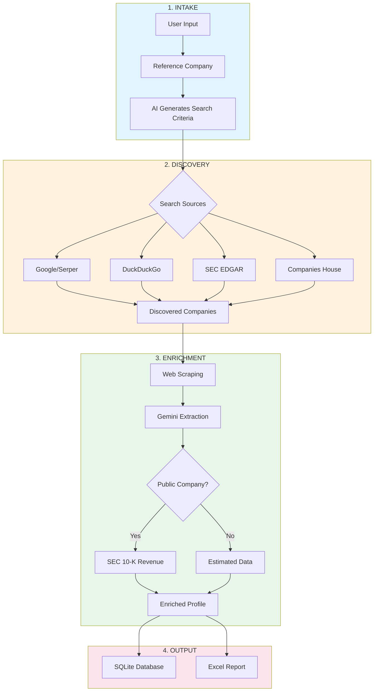
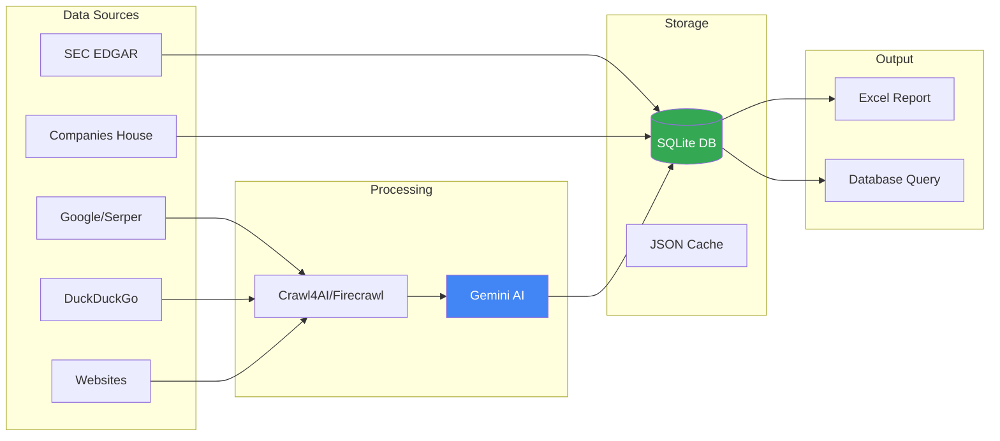

<div align="center">

# Portin

### M&A Target Discovery & Screening

[](https://python.org)
[](https://ai.google.dev)
[](LICENSE)


**Discover, research, and screen M&A targets.**

[Features](#features) • [Quick Start](#quick-start) • [How It Works](#how-it-works) • [Documentation](#documentation)

</div>

---

## Features

| Feature | Description |
|---------|-------------|
| **Smart Discovery** | Find companies via Google, DuckDuckGo, SEC EDGAR, and more |
| **AI Extraction** | Gemini extracts revenue, employees, services from websites |
| **SEC Validation** | Verified financials from 10-K filings for public companies |
| **Session Tracking** | Keep searches organized (Packaging vs Dairy, etc.) |
| **Excel Export** | Professional M&A screening spreadsheet output |


---

## Quick Start

### Option A: Automated Setup (Recommended for Beginners)

**Windows:**
```bash
# Double-click setup.bat or run:
setup.bat
```

**Mac/Linux:**
```bash
chmod +x setup.sh
./setup.sh
```

Then:
1. Copy `.env.example` to `.env`
2. Add your Gemini API key
3. Run the dashboard:
   ```bash
   python run.py
   ```
4. Open http://localhost:5000

### Option B: Manual Setup

```bash
git clone https://github.com/yourusername/portin.git
cd portin

# Create virtual environment
python -m venv venv
venv\Scripts\activate  # Windows
source venv/bin/activate  # Mac/Linux

# Install dependencies
pip install -r requirements.txt
playwright install chromium

# Configure API keys
cp .env.example .env
# Edit .env with your keys

# Start dashboard
python run.py
```

Open http://localhost:5000

### Need Help?

See **[SETUP.md](SETUP.md)** for detailed step-by-step instructions.

---

## Using Porto

### Dashboard (Recommended)

The modern web interface with real-time updates:

```bash
python run.py
```

Then go to http://localhost:5000

Features:
- Interactive search criteria builder
- Real-time discovery progress
- Clean glassmorphism UI
- Session management
- CSV export

### CLI (Advanced)

Or run all at once:

```bash
python run_pipeline.py
```

---

## How It Works



---

## Project Structure

```
portin/
├── intake/
│   └── lead_researcher.py    # AI-powered criteria generation
├── discovery/
│   └── engine.py             # Multi-source company discovery
├── enrichment/
│   └── screener.py           # Company enrichment & scoring
├── sources/
│   ├── crawl4ai_scraper.py   # Web scraping (Playwright)
│   ├── sec_edgar.py          # SEC EDGAR API
│   ├── companies_house.py    # UK Companies House
│   ├── opencorporates.py     # Global company registry
│   └── ddg_search.py         # DuckDuckGo fallback
├── data/
│   └── db.py                 # SQLite database operations
├── utils/
│   ├── logging.py            # Structured logging
│   └── retry.py              # API retry logic
├── run_intake.py             # Step 1: Define search
├── run_discovery.py          # Step 2: Find companies
├── run_enrichment.py         # Step 3: Enrich data
├── run_pipeline.py           # Run all steps
├── run_maintenance.py        # Re-score & tag companies
└── requirements.txt
```

---

## Configuration

### Search Engine Selection

During discovery, you'll be prompted:

```
SEARCH ENGINE SELECTION
--------------------------------------------
[1] Google (Serper) - Best quality, needs API key
[2] DuckDuckGo - Free, no API key needed
[3] Both - Serper first, DDG fallback

Select [1/2/3]:
```

### Scraper Selection

During enrichment:

```
SCRAPER SELECTION
--------------------------------------------
[1] Crawl4AI - Free, local browser (recommended)
[2] Firecrawl - API-based, 500 free credits
[3] Both - Crawl4AI first, Firecrawl fallback

Select [1/2/3]:
```

---

## Output Example

### Excel Report

| Company | Revenue | Employees | Location | Priority | Confidence |
|---------|---------|-----------|----------|----------|------------|
| Sonoco | $7.2B | 20,000 | SC, USA | Tier 1 | Verified |
| PakFactory | $50M | 200 | Toronto | Tier 2 | Estimated |
| EcoEnclose | $25M | 100 | CO, USA | Tier 2 | Estimated |

### Database Stats

```
[DB] Database Status:
     Total companies: 95
     Already enriched: 20
     Need enrichment: 75

[DB] Available Sessions:
     [1] Session #2 (2024-12-17) - 40 companies - "Packaging"
     [2] Session #1 (2024-12-16) - 55 companies - "Printing"
```

---


## Maintenance Utilities

Re-score companies or add industry tags:

```bash
python run_maintenance.py
```

```
OPTIONS
--------------------------------------------
[1] Re-score all companies with Gemini
[2] Add industry tags to companies
[3] Both (score + tag)
[4] View current scores
```

---

## Architecture



---

## Contributing

1. Fork the repository
2. Create a feature branch (`git checkout -b feature/amazing`)
3. Commit changes (`git commit -m 'Add amazing feature'`)
4. Push to branch (`git push origin feature/amazing`)
5. Open a Pull Request

---

## License

MIT License - see [LICENSE](LICENSE) for details.

---

<div align="center">


[Back to Top](#portin)

</div>
